# UAV_Benchmark使用说明

## 概要

benchmark包括UAV123、DTB70、UAVDT三个，基本类似。

以UAV123_benchmark为例，主要使用函数：

- main_running：调用跟踪器跑数据集
- perfPlot：绘制Precision plots和Success plots
- AboutFPS：分析跟踪器的处理速度
- AboutAllRes：分析跟踪器在各视频序列下的跟踪结果（error及overlap）
- AboutAtt：分析跟踪器在数据集各属性下的跟踪结果（error及overlap）
- AboutBoxplot：分析跟踪器在数据集各属性下跟踪结果的箱型图（error及overlap）
- drawResultBB：绘制跟踪器的跟踪结果框图.png
- makeVideo：将跟踪结果框图.png制作成视频
- BB_label：绘制视频中框图（bounding box）的label

## 使用说明

### main_running

这是一键跑数据集脚本（以前的另一个脚本没再更新了），利用的是上一篇说的 run_xxx 函数接口。

上一篇地址：

main_running 中需要修改的地方：

1. dataPath：数据集位置
2. annoPath：对应的anno文件（这些文件就在 ./anno/ 里面）
3. evalType：评估方式OPE或者SRE（一般就OPE即可，SRE之类的可以看OTB文章）

在运行前，完成以下几步：

1. 将自己的代码放于 ./trackers/ 中，并以自己跟踪器的代码进行命名，例如V4R，并且保证调用的函数接口为 run_V4R 。
2. 进入 ./util/ 中对 configTrackers 进行更改，在某个组合的结构体中增加这句话：

    struct('name','V4R','namePaper','V4R')

    建议组合用 trackers+期刊会议+年份+作者+其他 的形式进行命名，例如trackers_ICRA19_LFL（包含了所有要比较的跟踪器）。

    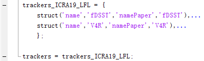

    *有这个文件才知道要跑哪些跟踪器，并且已有了某个视频序列的跟踪结果的跟踪器是不会被运行的。比如V4R跑到了第4个视频序列时电脑关机了，下次直接运行时会直接从第4个开始跑，因为前几个视频序列的结果已经存在。*

3. 进入 configSeqs 进行更改，在最后一行选择对应的结构体。例如选择 seqsUAV123_10fps，代表运行时候是全部视频序列都跑。

    这个文件用来控制跑哪些视频序列，因此可以新建结构体存放要制作视频的视频序列，或者是作为测试用：

    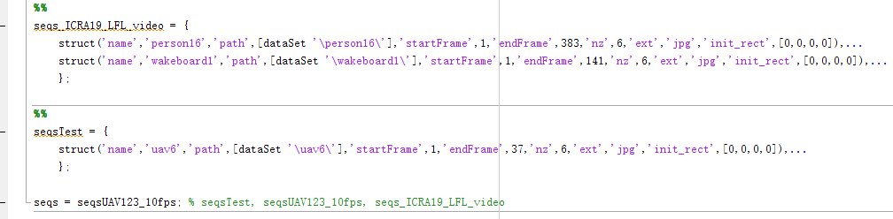

    *选uav6作为测试，是因为该视频帧数最少，只有37帧。UAV123_10fps数据集的帧数和属性可以上这里看*[https://zerolfl.github.io/blog/2019/01/02/UAV123-Dataset-Content/](https://zerolfl.github.io/blog/2019/01/02/UAV123-Dataset-Content/)*：*

最后就能愉快的**一键起飞**了！（建议一键起飞的时候关闭跟踪过程的可视化）

运行时命名行窗口出现：

运行结束出现：

具体含义如下：

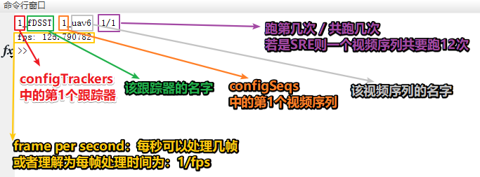

跑完的**结果储存**在 ./results/ 里面，如果是OPE模式，即在 ./results/results_OPE ：

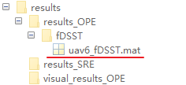

### perfPlot

绘制Precision plots和Success plots，包括总结果（overall performance）图和属性结果（att performace）图。

主要更改的地方：

- paperTitle：针对的会议或期刊名称和作者，**例如 ICRA19_LFL**
- saveOverallPerfPlot：true，保存overall performance的图；false，不保存
- AttPerfPlot：true，计算att performace并绘图；false，不绘图
- saveAttPerfPlot：true，保存att performance的图；false，不保存

然后就一键绘图！（画的是configTrackers中跟踪器对应在configSeqs下视频序列的**结果**）

比如，configSeqs里面是UAV123_10fps，那么运行时，命令窗口会出现：

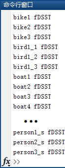

最后跳出总结果图（这里没有画属性结果图）：

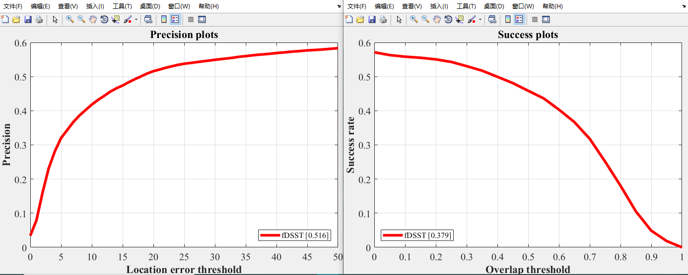

运行结束后，会出现以下文件：

1. 在 ./perfMat/overall/ 里面出现 aveSuccessRatePlot_1alg_error_OPE.mat 和 *overlap_OPE.mat 两个文件，这里面的“1”表示只有1个跟踪器的结果；两个mat文件具体内容如下：

    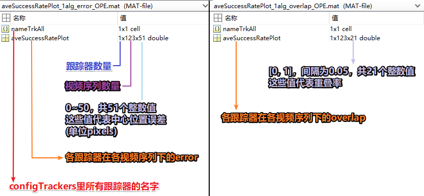

    *因此，如果第二次画，只要仍是1个跟踪器数量的结果，会直接调用已经存在的这两个mat来画，因此需要提前删除这两mat再画新图。*

2. 在 ./dataAnaly/ 中出现刚刚设置的 paperTitle 相同名称的文件夹ICRA_LFL：

    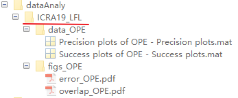

    里面包含了两个文件夹：data_OPE 和 figs_OPE，分别存储了mat 和 pdf 。

    *这里的mat不是完全体，只是保存了某个阈值下的error和overlap（用于ranking的值）。pdf就是上面写的总结果图了，用于latex的写作。*

### AboutFPS

用于计算各跟踪器在所对应视频序列下的**平均处理速度**，并生成柱状图。

主要更改的地方：

- dataPath：数据集位置
- paperTitle：针对的会议或期刊名称和作者，**例如 ICRA19_LFL**
- saveFpsFig：true，保存绘图结果；false，不保存
- drawFpsBaseline = true：true，绘制基准线；false，不绘制基准线
- fpsBaseline：fps基准线位置

运行后出现类似柱状图：

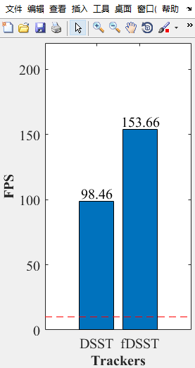

以及存储结果地址：

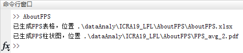

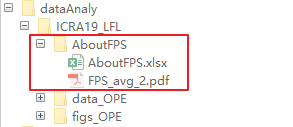

这里存储的pdf就是上面画的柱状图，而 excel 文件记录了所有各跟踪器在各视频序列上的fps。

### AboutAllRes

分析跟踪器在各视频序列下的跟踪结果（在某个阈值下的error及overlap，阈值一般是20pixels及AUC）。

主要更改的地方：

- dataPath：数据集位置
- paperTitle：针对的会议或期刊名称和作者，**例如 ICRA19_LFL**

相当于把**各视频序列的跟踪结果**做成了excel表格以进行进一步分析。

运行后出现结果存储地址：

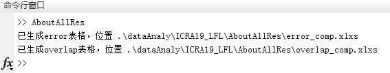

### AboutAtt

分析跟踪器在数据集各属性下的跟踪结果（在某个阈值下的error及overlap，阈值一般是20pixels及AUC）。

主要更改的地方：

- paperTitle：针对的会议或期刊名称和作者，**例如 ICRA19_LFL**

在运行该脚本时，需先将perPlot里的**参数**AttPerfPlot置为true再运行

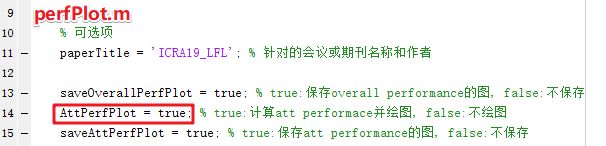

才会生成各属性的跟踪结果mat文件：

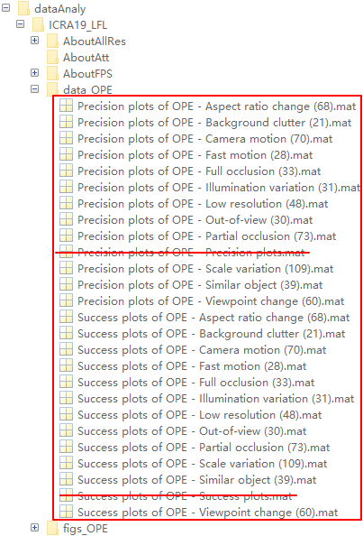

该脚本相当于把**各属性下的跟踪结果**做成了excel表格以进行进一步分析，运行后出现结果存储地址：

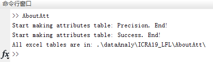

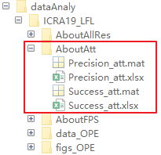

### AboutBoxplot

分析跟踪器在数据集各属性下跟踪结果的箱型图（在某个阈值下的error及overlap，阈值一般是20pixels及AUC）。

主要更改的地方：

- paperTitle：针对的会议或期刊名称和作者，**例如 ICRA19_LFL**

该脚本相当于把各属性下的跟踪结果做成了**箱型图**以进行进一步分析，运行后出现结果存储地址：

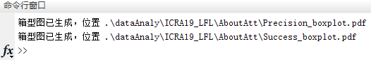

### drawResultBB

绘制 configTrackers 中的跟踪器在 configSeqs 中设置的数据集的跟踪结果框图。

主要更改的地方：

- dataPath：数据集位置
- paperTitle：针对的会议或期刊名称和作者，**例如 ICRA19_LFL**
- visibleDraw：'on'，可视化绘图过程；'off'，不可视化，但能保存图片（如果运行到一半matlab自动关闭就设为on）

要注意的是：

- location：自己的tracker放在configTrackers里的最后，画图时才会位于最上图层，保证自己的跟踪器是红色框

    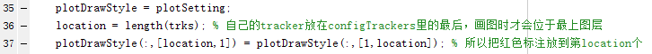

相当于制作**指定的跟踪器**在**指定的视频序列**上的跟踪框图.png，运行后出现：

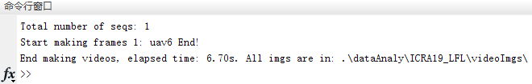

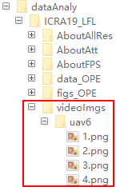

### makeVideo

将跟踪结果框图.png制作成视频。

主要更改的地方：

- fps：视频帧率
- paperTitle：针对的会议或期刊名称和作者，**例如 ICRA19_LFL**

运行后出现：

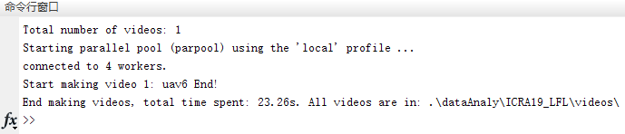

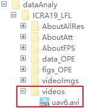

*注*：这里使用parfor循环进行处理，如果程序报错就改为for循环。

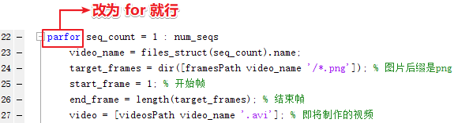

### BB_label

绘制视频中框图的label，主要更改的地方：

- paperTitle：针对的会议或期刊名称和作者，**例如 ICRA19_LFL**

要注意的是：

- location：自己的tracker放在configTrackers里的最后，画图时才会位于最上图层，保证自己的跟踪器是红色框

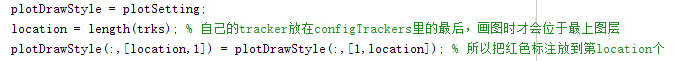

运行后出现：

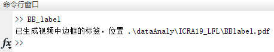

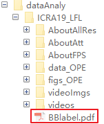

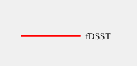

## 总结

将每次的分析结果都以 paperTitle 进行命名，并保存至 ./dataAnaly/paperTitle/ 文件夹里。

使得所用的分析数据得到合适的管理，避免过于混乱，且有助于以后重新找到这些数据（比如论文修改或者悲剧要重新投的时候）。