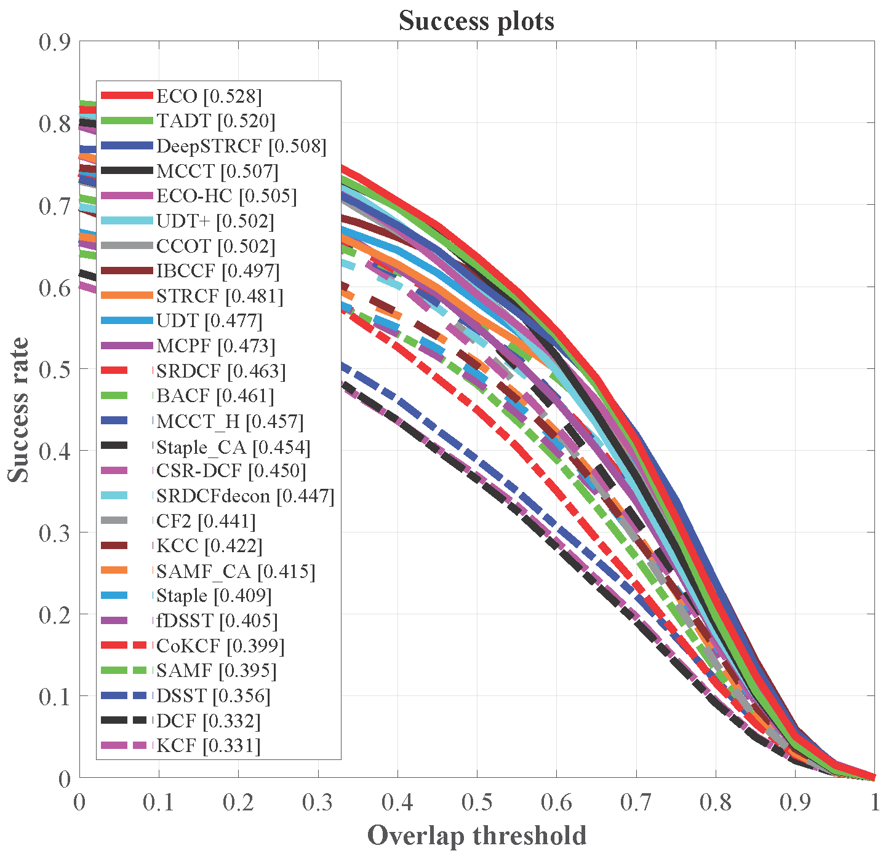
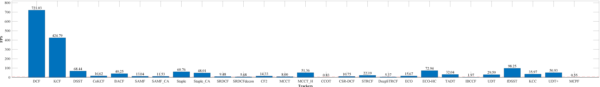
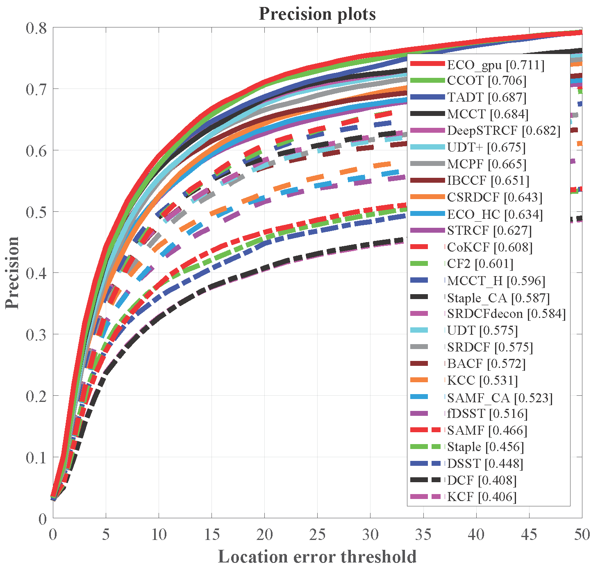
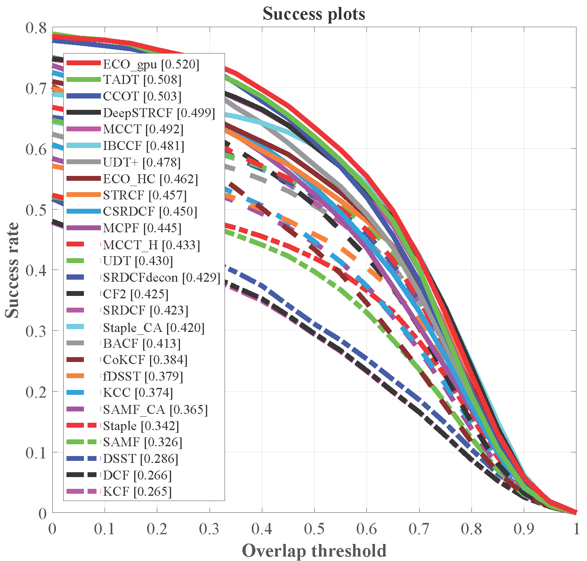
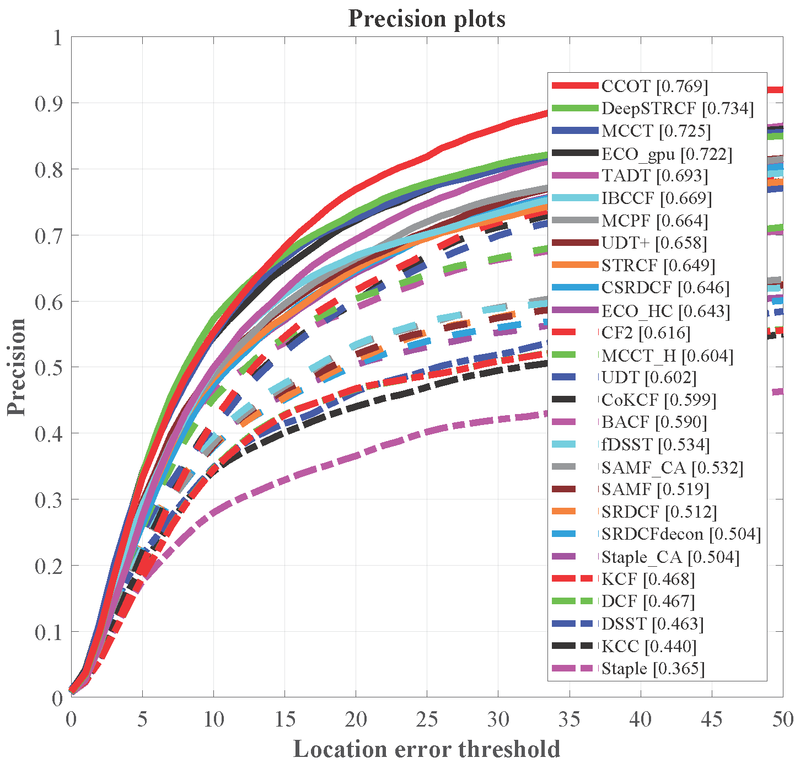
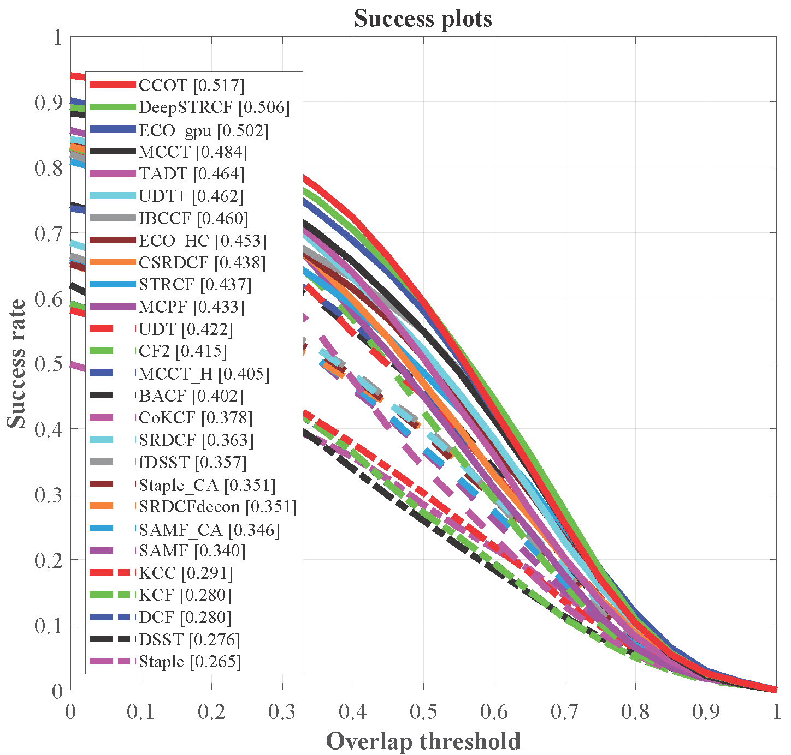
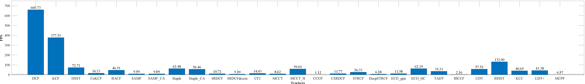
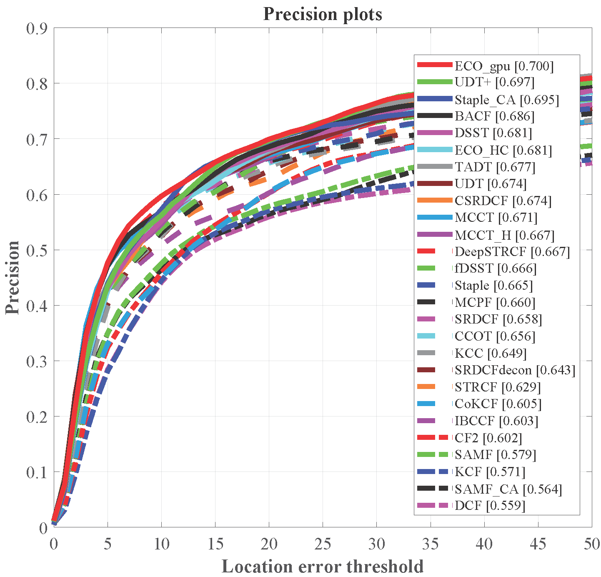
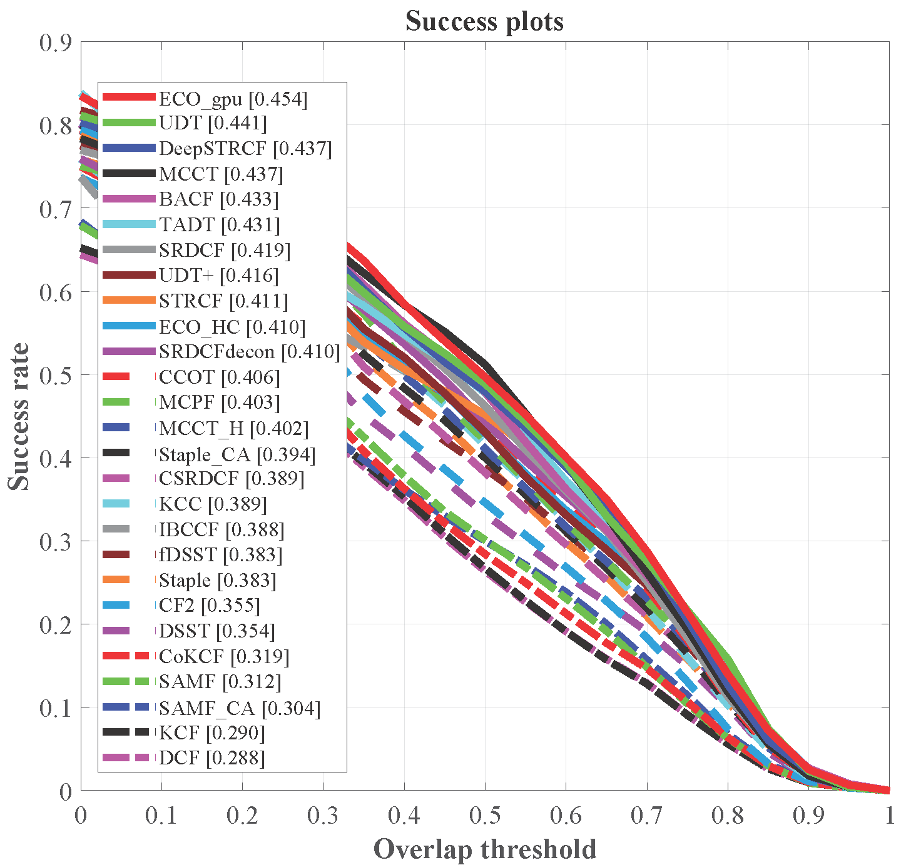
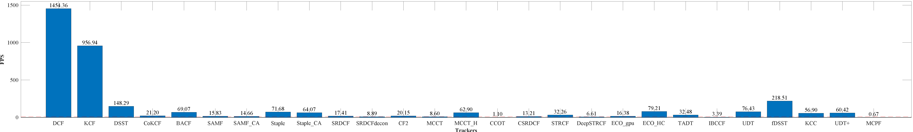

# V4R-benchmark

该repo为重新整理的benchmark，包括：[UAV123](https://ivul.kaust.edu.sa/Pages/Dataset-UAV123.aspx)，[UAVDT](https://sites.google.com/site/daviddo0323/projects/uavdt)，[DTB70](https://github.com/flyers/drone-tracking) 这三个benchmark，并增加部分工具脚本。

详细使用在WeChat组群内询问。

## 评估32跟踪器（Updating）

在UAV123、DTB70、UAVDT、VisDrone2019(除了testset-challenge部分的其他序列)上评估跟踪器（**OPE**模式）。

| 序号 | 跟踪器      | 会议/期刊 | 时间 | 是否改出run文件 | CPU  | GPU  | 详细信息                                          | UAV123 | UAV123_10fps | UAV20L | DTB70 | UAVDT | VisDrone2019(除了testset-challenge部分的其他序列) |
| ---- | ----------- | --------- | ---- | --------------- | ---- | ---- | ------------------------------------------------- | ------ | ------------ | ------ | ----- | ----- | ------------------------------------------------- |
| 1    | UDT+        | CVPR      | 2019 | ✔               |      | ✔    |                                                   |        |              |        |       |       |                                                   |
| 2    | UDT         | CVPR      | 2019 | ✔               |      | ✔    |                                                   |        |              |        |       |       |                                                   |
| 3    | TADT        | CVPR      | 2019 | ✔               |      | ✔    | imagenet-vgg-verydeep-16                          |        |              |        |       |       |                                                   |
| 4    | VITAL       | CVPR      | 2018 | ✔               |      | ✔    |                                                   |        |              |        |       |       |                                                   |
| 5    | STRCF       | CVPR      | 2018 | ✔               | ✔    |      | HOG+CN                                            |        |              |        |       |       |                                                   |
| 6    | MCCT-H      | CVPR      | 2018 | ✔               | ✔    |      | HOG+CN                                            |        |              |        |       |       |                                                   |
| 7    | MCCT        | CVPR      | 2018 | ✔               |      | ✔    | imagenet-vgg-verydeep-19                          |        |              |        |       |       |                                                   |
| 8    | KCC         | AAAI      | 2018 | ✔               | ✔    |      | HOG                                               |        |              |        |       |       |                                                   |
| 9    | DeepSTRCF   | CVPR      | 2018 | ✔               |      | ✔    | HOG+CN+imagenet-vgg-m-2048                        |        |              |        |       |       |                                                   |
| 10   | Staple_CA   | CVPR      | 2017 | ✔               | ✔    |      | HOG+Color historgram                              |        |              |        |       |       |                                                   |
| 11   | SRDCF       | ICCV      | 2017 | ✔               | ✔    |      | HOG                                               |        |              |        |       |       |                                                   |
| 12   | SAMF_CA     | CVPR      | 2017 | ✔               | ✔    |      | HOG+CN                                            |        |              |        |       |       |                                                   |
| 13   | MCPF        | CVPR      | 2017 | ✔               |      | ✔    | imagenet-vgg-verydeep-19(Conv3-4+Conv4-4+Conv5-4) |        |              |        |       |       |                                                   |
| 14   | IBCCF       | ICCVws    | 2017 | ✔               |      | ✔    | imagenet-vgg-verydeep-19                          |        |              |        |       |       |                                                   |
| 15   | fDSST       | PAMI      | 2017 | ✔               | ✔    |      | HOG                                               |        |              |        |       |       |                                                   |
| 16   | ECO-HC      | CVPR      | 2017 | ✔               | ✔    |      | HOG+CN                                            |        |              |        |       |       |                                                   |
| 17   | ECO         | CVPR      | 2017 | ✔               |      | ✔    | HOG+imagenet-vgg-m-2048                           |        |              |        |       |       |                                                   |
| 18   | CSR-DCF     | CVPR      | 2017 | ✔               | ✔    |      | HOG+CN                                            |        |              |        |       |       |                                                   |
| 19   | CoKCF       | PR        | 2017 | ✔               |      | ✔    | imagenet-vgg-verydeep-19(Conv4-4+Conv5-4)         |        |              |        |       |       |                                                   |
| 20   | CFWCR       | ICCVws    | 2017 | ✔               |      | ✔    | imagenet-vgg-m-2048                               |        |              |        |       |       |                                                   |
| 21   | CFNet_conv2 | CVPR      | 2017 | ✔               |      | ✔    |                                                   |        |              |        |       |       |                                                   |
| 22   | BACF        | ICCV      | 2017 | ✔               | ✔    |      | HOG                                               |        |              |        |       |       |                                                   |
| 23   | ADNet       | CVPR      | 2017 | ✔               |      | ✔    |                                                   |        |              |        |       |       |                                                   |
| 24   | Staple      | CVPR      | 2016 | ✔               | ✔    |      | HOG+Color historgram                              |        |              |        |       |       |                                                   |
| 25   | SRDCFdecon  | CVPR      | 2016 | ✔               | ✔    |      | HOG                                               |        |              |        |       |       |                                                   |
| 26   | SiameseFC   | ECCV      | 2016 | ✔               |      | ✔    |                                                   |        |              |        |       |       |                                                   |
| 27   | C-COT       | ECCV      | 2016 | ✔               | ✔    |      | imagenet-vgg-m-2048                               |        |              |        |       |       |                                                   |
| 28   | CF2         | ICCV      | 2015 | ✔               |      | ✔    | imagenet-vgg-verydeep-19(Conv3-4+Conv4-4+Conv5-4) |        |              |        |       |       |                                                   |
| 29   | SAMF        | ECCVws    | 2014 | ✔               | ✔    |      | HOG+CN                                            |        |              |        |       |       |                                                   |
| 30   | KCF         | PAMI      | 2015 | ✔               | ✔    |      | HOG                                               |        |              |        |       |       |                                                   |
| 31   | DSST        | BMVC      | 2014 | ✔               | ✔    |      | HOG                                               |        |              |        |       |       |                                                   |
| 32   | DCF         | PAMI      | 2014 | ✔               | ✔    |      | HOG                                               |        |              |        |       |       |                                                   |

## Results_win10_i7_2080_R2019a

结果在如下配置环境中得到：

- windows 10 64-bit
- Intel Core i7-8700K（3.70GHz）
- 32G RAM
- Nvidia GeForce RTX 2080
- Matlab 2019a
- CUDA10
- VS2017

待更新...

## Results_win10_i7_2080_R2017b

结果在如下配置环境中得到：

- windows 10 64-bit
- Intel Core i7-8700K（3.70GHz）
- 32G RAM
- Nvidia GeForce RTX 2080
- Matlab 2017b

跟踪结果在[百度云盘](https://pan.baidu.com/s/1AvKSwopOSWUDncS8qOam9Q)中获取，提取码：jeub。

   
    
<b>UAV123总体结果和FPS</b>
 
    
 
        
         
        
    

   
    
<b>UAV20L总体结果和FPS</b>
 
    
 
        
        
        
    

   
    
<b>UAV123_10fps总体结果和FPS</b>
 
    
 
        
        
        
    

   
    
<b>DTB70总体结果和FPS</b>
 
    
 
        
        
        
    

   
    
<b>UAVDT总体结果和FPS</b>
 
  
 
        
        
        
    

   
    
<b>所有结果汇总表格</b>
 
    
 
<table border='0' cellpadding='0' cellspacing='0' width='2471' style='border-collapse: 
 collapse;table-layout:fixed;width:1853pt'>
 <col width='104' style='mso-width-source:userset;width:78pt'>
 <col width='72' style='width:54pt'>
 <col width='85' span='27' style='mso-width-source:userset;width:63.75pt'>
 <tr height='19' style='mso-height-source:userset;height:14.25pt' id='r0'>
<td height='19' class='x21' width='104' style='height:14.25pt;width:78pt;'></td>
<td class='x21' width='72' style='width:54pt;'></td>
<td class='x21' width='85' style='width:63.75pt;'>DCF</td>
<td class='x21' width='85' style='width:63.75pt;'>KCF</td>
<td class='x21' width='85' style='width:63.75pt;'>DSST</td>
<td class='x21' width='85' style='width:63.75pt;'>CoKCF</td>
<td class='x21' width='85' style='width:63.75pt;'>BACF</td>
<td class='x21' width='85' style='width:63.75pt;'>SAMF</td>
<td class='x21' width='85' style='width:63.75pt;'>SAMF_CA</td>
<td class='x21' width='85' style='width:63.75pt;'>Staple</td>
<td class='x21' width='85' style='width:63.75pt;'>Staple_CA</td>
<td class='x21' width='85' style='width:63.75pt;'>SRDCF</td>
<td class='x21' width='85' style='width:63.75pt;overflow:hidden;'>
SRDCFdecon
</td>
<td class='x21' width='85' style='width:63.75pt;'>CF2</td>
<td class='x21' width='85' style='width:63.75pt;'>MCCT</td>
<td class='x21' width='85' style='width:63.75pt;'>MCCT_H</td>
<td class='x21' width='85' style='width:63.75pt;'>CCOT</td>
<td class='x21' width='85' style='width:63.75pt;'>CSR-DCF</td>
<td class='x21' width='85' style='width:63.75pt;'>STRCF</td>
<td class='x21' width='85' style='width:63.75pt;'>DeepSTRCF</td>
<td class='x21' width='85' style='width:63.75pt;'>ECO</td>
<td class='x21' width='85' style='width:63.75pt;'>ECO-HC</td>
<td class='x21' width='85' style='width:63.75pt;'>TADT</td>
<td class='x21' width='85' style='width:63.75pt;'>IBCCF</td>
<td class='x21' width='85' style='width:63.75pt;'>UDT</td>
<td class='x21' width='85' style='width:63.75pt;'>fDSST</td>
<td class='x21' width='85' style='width:63.75pt;'>KCC</td>
<td class='x21' width='85' style='width:63.75pt;'>UDT+</td>
<td class='x21' width='85' style='width:63.75pt;'>MCPF</td>
 </tr>
 <tr height='19' style='mso-height-source:userset;height:14.25pt' id='r1'>
<td height='19' class='x21' style='height:14.25pt;'>&nbsp;UAV123</td>
<td class='x21'>Prec.</td>
<td class='x22' x:num="0.52633759319080509">0.526</td>
<td class='x22' x:num="0.52335973135793201">0.523</td>
<td class='x22' x:num="0.5861391587340935">0.586</td>
<td class='x22' x:num="0.65233537679027265">0.652</td>
<td class='x22' x:num="0.66247968959824333">0.662</td>
<td class='x22' x:num="0.59278553847991022">0.593</td>
<td class='x22' x:num="0.6052638266287842">0.605</td>
<td class='x22' x:num="0.59472169465060198">0.595</td>
<td class='x22' x:num="0.67231955944453592">0.672</td>
<td class='x22' x:num="0.67648265777348449">0.676</td>
<td class='x22' x:num="0.63062902757597827">0.631</td>
<td class='x22' x:num="0.65456204940967821">0.655</td>
<td class='x22' x:num="0.73437328589350104" style='mso-ignore:style;font-size:11pt;color:#00FF00;font-weight:700;text-decoration:none;text-line-through:none;font-family:"等线";background:auto;mso-pattern:auto;'>0.734</td>
<td class='x22' x:num="0.65940278977943778">0.659</td>
<td class='x22' x:num="0.72939235766893173">0.729</td>
<td class='x22' x:num="0.67575027277829158">0.676</td>
<td class='x22' x:num="0.68129671618976062">0.681</td>
<td class='x22' x:num="0.70451646587486394">0.705</td>
<td class='x22' x:num="0.75196868127463568" style='mso-ignore:style;font-size:11pt;color:#FF0000;font-weight:700;text-decoration:none;text-line-through:none;font-family:"等线";background:auto;mso-pattern:auto;'>0.752</td>
<td class='x22' x:num="0.7156182105452028">0.716</td>
<td class='x22' x:num="0.72683937822396905">0.727</td>
<td class='x22' x:num="0.69609190410429">0.696</td>
<td class='x22' x:num="0.66802634978259734">0.668</td>
<td class='x22' x:num="0.58270177800933209">0.583</td>
<td class='x22' x:num="0.61995500995078601">0.620</td>
<td class='x22' x:num="0.731923560693574" style='mso-ignore:style;font-size:11pt;color:#0000FF;font-weight:700;text-decoration:none;text-line-through:none;font-family:"等线";background:auto;mso-pattern:auto;'>0.732</td>
<td class='x22' x:num="0.7183342034886806">0.718</td>
 </tr>
 <tr height='19' style='mso-height-source:userset;height:14.25pt' id='r2'>
<td height='19' class='x21' style='height:14.25pt;'></td>
<td class='x21'>Succ.</td>
<td class='x22' x:num="0.3322297799587523">0.332</td>
<td class='x22' x:num="0.33072468747470268">0.331</td>
<td class='x22' x:num="0.35580904479792841">0.356</td>
<td class='x22' x:num="0.39914223344235056">0.399</td>
<td class='x22' x:num="0.46096359657968716">0.461</td>
<td class='x22' x:num="0.3953605228372693">0.395</td>
<td class='x22' x:num="0.41480878706400143">0.415</td>
<td class='x22' x:num="0.40946367754762059">0.409</td>
<td class='x22' x:num="0.45373814527978001">0.454</td>
<td class='x22' x:num="0.46302253226169565">0.463</td>
<td class='x22' x:num="0.44747190423941902">0.447</td>
<td class='x22' x:num="0.4409066416122101">0.441</td>
<td class='x22' x:num="0.50674855251931483">0.507</td>
<td class='x22' x:num="0.45731621486711355">0.457</td>
<td class='x22' x:num="0.50151715771174699">0.502</td>
<td class='x22' x:num="0.44985267747904439">0.450</td>
<td class='x22' x:num="0.48099102547306444">0.481</td>
<td class='x22' x:num="0.50803907515005542" style='mso-ignore:style;font-size:11pt;color:#0000FF;font-weight:700;text-decoration:none;text-line-through:none;font-family:"等线";background:auto;mso-pattern:auto;'>0.508</td>
<td class='x22' x:num="0.52774865906248503" style='mso-ignore:style;font-size:11pt;color:#FF0000;font-weight:700;text-decoration:none;text-line-through:none;font-family:"等线";background:auto;mso-pattern:auto;'>0.528</td>
<td class='x22' x:num="0.50451034810320927">0.505</td>
<td class='x22' x:num="0.52035433377501705" style='mso-ignore:style;font-size:11pt;color:#00FF00;font-weight:700;text-decoration:none;text-line-through:none;font-family:"等线";background:auto;mso-pattern:auto;'>0.520</td>
<td class='x22' x:num="0.49732364985116029">0.497</td>
<td class='x22' x:num="0.4774584137669326">0.477</td>
<td class='x22' x:num="0.40453820689194653">0.405</td>
<td class='x22' x:num="0.42225219375157425">0.422</td>
<td class='x22' x:num="0.50166822309052417">0.502</td>
<td class='x22' x:num="0.47275524791236673">0.473</td>
 </tr>
 <tr height='19' style='mso-height-source:userset;height:14.25pt' id='r3'>
<td height='19' class='x21' style='height:14.25pt;'></td>
<td class='x21'>FPS</td>
<td class='x23' x:num="935.37134205959183" style='mso-ignore:style;font-size:11pt;color:#FF0000;font-weight:700;text-decoration:none;text-line-through:none;font-family:"等线";background:auto;mso-pattern:auto;'>935.4</td>
<td class='x23' x:num="632.50876188757741" style='mso-ignore:style;font-size:11pt;color:#00FF00;font-weight:700;text-decoration:none;text-line-through:none;font-family:"等线";background:auto;mso-pattern:auto;'>632.5</td>
<td class='x23' x:num="98.873221061780001">98.9</td>
<td class='x23' x:num="17.742827244533888">17.7</td>
<td class='x23' x:num="51.833109526532773">51.8</td>
<td class='x23' x:num="12.188675587167957">12.2</td>
<td class='x23' x:num="10.994781044261011">11.0</td>
<td class='x23' x:num="61.896393427424066">61.9</td>
<td class='x23' x:num="56.436319067227821">56.4</td>
<td class='x23' x:num="13.557382458183092">13.6</td>
<td class='x23' x:num="7.2563231134374755">7.3</td>
<td class='x23' x:num="16.257590062162834">16.3</td>
<td class='x23' x:num="8.3832375159841348">8.4</td>
<td class='x23' x:num="56.548847950739457">56.5</td>
<td class='x23' x:num="0.92734653502028541">0.9</td>
<td class='x23' x:num="11.615294724924043">11.6</td>
<td class='x23' x:num="26.709538316354461">26.7</td>
<td class='x23' x:num="6.0912284059232498">6.1</td>
<td class='x23' x:num="15.351272708651084">15.4</td>
<td class='x23' x:num="73.195471581085542">73.2</td>
<td class='x23' x:num="33.815643125767707">33.8</td>
<td class='x23' x:num="2.3981387138377914">2.4</td>
<td class='x23' x:num="58.657109514014529">58.7</td>
<td class='x23' x:num="152.1576421212213" style='mso-ignore:style;font-size:11pt;color:#0000FF;font-weight:700;text-decoration:none;text-line-through:none;font-family:"等线";background:auto;mso-pattern:auto;'>152.2</td>
<td class='x23' x:num="40.439213539086019">40.4</td>
<td class='x23' x:num="53.883411627347861">53.9</td>
<td class='x23' x:num="0.57291804453479023">0.6</td>
 </tr>
 <tr height='19' style='mso-height-source:userset;height:14.25pt' id='r4'>
<td height='19' class='x21' style='height:14.25pt;'>UAV20L</td>
<td class='x21'>Prec.</td>
<td class='x22' x:num="0.32126508299397477">0.321</td>
<td class='x22' x:num="0.31099413353200012">0.311</td>
<td class='x22' x:num="0.45862134653433706">0.459</td>
<td class='x22' x:num="0.50695198886429316">0.507</td>
<td class='x22' x:num="0.58380984457731244">0.584</td>
<td class='x22' x:num="0.47044858918678978">0.470</td>
<td class='x22' x:num="0.5373705781030268">0.537</td>
<td class='x22' x:num="0.45515426754284932">0.455</td>
<td class='x22' x:num="0.49701145027514082">0.497</td>
<td class='x22' x:num="0.50714707859295105">0.507</td>
<td class='x22' x:num="0.44270758204904326">0.443</td>
<td class='x22' x:num="0.49017469841555394">0.490</td>
<td class='x22' x:num="0.60506047060096124" style='mso-ignore:style;font-size:11pt;color:#0000FF;font-weight:700;text-decoration:none;text-line-through:none;font-family:"等线";background:auto;mso-pattern:auto;'>0.605</td>
<td class='x22' x:num="0.56826432662358095">0.568</td>
<td class='x22' x:num="0.56117245973480645">0.561</td>
<td class='x22' x:num="0.51496851774576358">0.515</td>
<td class='x22' x:num="0.57544971868452832">0.575</td>
<td class='x22' x:num="0.58767623972872485">0.588</td>
<td class='x22' x:num="0.58908257456687763">0.589</td>
<td class='x22' x:num="0.52181046070421189">0.522</td>
<td class='x22' x:num="0.60872791565171591" style='mso-ignore:style;font-size:11pt;color:#00FF00;font-weight:700;text-decoration:none;text-line-through:none;font-family:"等线";background:auto;mso-pattern:auto;'>0.609</td>
<td class='x22' x:num="0.61285183870564119" style='mso-ignore:style;font-size:11pt;color:#FF0000;font-weight:700;text-decoration:none;text-line-through:none;font-family:"等线";background:auto;mso-pattern:auto;'>0.613</td>
<td class='x22' x:num="0.5142435571210221">0.514</td>
<td class='x22' x:num="0.38478070288910088">0.385</td>
<td class='x22' x:num="0.48276911168641218">0.483</td>
<td class='x22' x:num="0.58497325651064858">0.585</td>
<td class='x22' x:num="0.58615872833447968">0.586</td>
 </tr>
 <tr height='19' style='mso-height-source:userset;height:14.25pt' id='r5'>
<td height='19' class='x21' style='height:14.25pt;'></td>
<td class='x21'>Succ.</td>
<td class='x22' x:num="0.20832821669125684">0.208</td>
<td class='x22' x:num="0.19595654582814911">0.196</td>
<td class='x22' x:num="0.27019810635547109">0.270</td>
<td class='x22' x:num="0.29847775540691746">0.298</td>
<td class='x22' x:num="0.41505493709198388">0.415</td>
<td class='x22' x:num="0.32585729038160416">0.326</td>
<td class='x22' x:num="0.3520882457209783">0.352</td>
<td class='x22' x:num="0.33065600404285561">0.331</td>
<td class='x22' x:num="0.34521255107762749">0.345</td>
<td class='x22' x:num="0.3428329432310071">0.343</td>
<td class='x22' x:num="0.32751935481870814">0.328</td>
<td class='x22' x:num="0.35246564412171905">0.352</td>
<td class='x22' x:num="0.40708698864194626">0.407</td>
<td class='x22' x:num="0.37822268540003234">0.378</td>
<td class='x22' x:num="0.39489510887985846">0.395</td>
<td class='x22' x:num="0.36048342247183163">0.360</td>
<td class='x22' x:num="0.41073168037258173">0.411</td>
<td class='x22' x:num="0.44285064958337167" style='mso-ignore:style;font-size:11pt;color:#00FF00;font-weight:700;text-decoration:none;text-line-through:none;font-family:"等线";background:auto;mso-pattern:auto;'>0.443</td>
<td class='x22' x:num="0.42715650692208501">0.427</td>
<td class='x22' x:num="0.38672272972188793">0.387</td>
<td class='x22' x:num="0.45881862962141212" style='mso-ignore:style;font-size:11pt;color:#FF0000;font-weight:700;text-decoration:none;text-line-through:none;font-family:"等线";background:auto;mso-pattern:auto;'>0.459</td>
<td class='x22' x:num="0.43494382287652622" style='mso-ignore:style;font-size:11pt;color:#0000FF;font-weight:700;text-decoration:none;text-line-through:none;font-family:"等线";background:auto;mso-pattern:auto;'>0.435</td>
<td class='x22' x:num="0.36349827166863774">0.363</td>
<td class='x22' x:num="0.28786789989792938">0.288</td>
<td class='x22' x:num="0.32402515963874351">0.324</td>
<td class='x22' x:num="0.40118387434751862">0.401</td>
<td class='x22' x:num="0.36987419601830218">0.370</td>
 </tr>
 <tr height='19' style='mso-height-source:userset;height:14.25pt' id='r6'>
<td height='19' class='x21' style='height:14.25pt;'></td>
<td class='x21'>FPS</td>
<td class='x23' x:num="721.03010876414066" style='mso-ignore:style;font-size:11pt;color:#FF0000;font-weight:700;text-decoration:none;text-line-through:none;font-family:"等线";background:auto;mso-pattern:auto;'>721.0</td>
<td class='x23' x:num="424.78789422705302" style='mso-ignore:style;font-size:11pt;color:#00FF00;font-weight:700;text-decoration:none;text-line-through:none;font-family:"等线";background:auto;mso-pattern:auto;'>424.8</td>
<td class='x23' x:num="68.441447718984193">68.4</td>
<td class='x23' x:num="16.624535020372498">16.6</td>
<td class='x23' x:num="40.248239505299452">40.2</td>
<td class='x23' x:num="13.037282566710928">13.0</td>
<td class='x23' x:num="11.531277218774223">11.5</td>
<td class='x23' x:num="60.756832092337149">60.8</td>
<td class='x23' x:num="48.012336308825354">48.0</td>
<td class='x23' x:num="9.4751422463620756">9.5</td>
<td class='x23' x:num="5.6803391093824818">5.7</td>
<td class='x23' x:num="14.328857397161865">14.3</td>
<td class='x23' x:num="7.9966232237864121">8.0</td>
<td class='x23' x:num="51.357582438828999">51.4</td>
<td class='x23' x:num="0.83019078914768818">0.8</td>
<td class='x23' x:num="10.748255855936291">10.7</td>
<td class='x23' x:num="22.185730452804115">22.2</td>
<td class='x23' x:num="5.3734914548339789">5.4</td>
<td class='x23' x:num="15.667268408251633">15.7</td>
<td class='x23' x:num="72.935126948479947">72.9</td>
<td class='x23' x:num="32.040988148947754">32.0</td>
<td class='x23' x:num="1.9706973496607874">2.0</td>
<td class='x23' x:num="29.585641464593628">29.6</td>
<td class='x23' x:num="98.253178967409909" style='mso-ignore:style;font-size:11pt;color:#0000FF;font-weight:700;text-decoration:none;text-line-through:none;font-family:"等线";background:auto;mso-pattern:auto;'>98.3</td>
<td class='x23' x:num="35.967527820510689">36.0</td>
<td class='x23' x:num="50.927799494548836">50.9</td>
<td class='x23' x:num="0.54719639104713236">0.5</td>
 </tr>
 <tr height='19' style='mso-height-source:userset;height:14.25pt' id='r7'>
<td height='19' class='x21' style='height:14.25pt;'>UAV123_10fps</td>
<td class='x21'>Prec.</td>
<td class='x22' x:num="0.4079568924856718">0.408</td>
<td class='x22' x:num="0.40620146091893228">0.406</td>
<td class='x22' x:num="0.44784664132517632">0.448</td>
<td class='x22' x:num="0.60813042949764085">0.608</td>
<td class='x22' x:num="0.57214094217069389">0.572</td>
<td class='x22' x:num="0.46606197507524466">0.466</td>
<td class='x22' x:num="0.52261281401532411">0.523</td>
<td class='x22' x:num="0.4563361906783438">0.456</td>
<td class='x22' x:num="0.58673441568912599">0.587</td>
<td class='x22' x:num="0.57456322659027892">0.575</td>
<td class='x22' x:num="0.58364050921804489">0.584</td>
<td class='x22' x:num="0.60086751923578741">0.601</td>
<td class='x22' x:num="0.6839066617337114">0.684</td>
<td class='x22' x:num="0.59565313307886536">0.596</td>
<td class='x22' x:num="0.70635126317046304" style='mso-ignore:style;font-size:11pt;color:#00FF00;font-weight:700;text-decoration:none;text-line-through:none;font-family:"等线";background:auto;mso-pattern:auto;'>0.706</td>
<td class='x22' x:num="0.64345712138937183">0.643</td>
<td class='x22' x:num="0.62729211228109005">0.627</td>
<td class='x22' x:num="0.68176997707197129">0.682</td>
<td class='x22' x:num="0.71105310539152111" style='mso-ignore:style;font-size:11pt;color:#FF0000;font-weight:700;text-decoration:none;text-line-through:none;font-family:"等线";background:auto;mso-pattern:auto;'>0.711</td>
<td class='x22' x:num="0.63425427283952363">0.634</td>
<td class='x22' x:num="0.68698751190074536" style='mso-ignore:style;font-size:11pt;color:#0000FF;font-weight:700;text-decoration:none;text-line-through:none;font-family:"等线";background:auto;mso-pattern:auto;'>0.687</td>
<td class='x22' x:num="0.65127858601955846">0.651</td>
<td class='x22' x:num="0.57517155459864044">0.575</td>
<td class='x22' x:num="0.51598113509151144">0.516</td>
<td class='x22' x:num="0.53071468459838955">0.531</td>
<td class='x22' x:num="0.67536033338579804">0.675</td>
<td class='x22' x:num="0.66544240017301903">0.665</td>
 </tr>
 <tr height='19' style='mso-height-source:userset;height:14.25pt' id='r8'>
<td height='19' class='x21' style='height:14.25pt;'></td>
<td class='x21'>Succ.</td>
<td class='x22' x:num="0.2661946746203066">0.266</td>
<td class='x22' x:num="0.26466911310005153">0.265</td>
<td class='x22' x:num="0.28554400314098721">0.286</td>
<td class='x22' x:num="0.38382119601951564">0.384</td>
<td class='x22' x:num="0.41300843731863507">0.413</td>
<td class='x22' x:num="0.32590809280689198">0.326</td>
<td class='x22' x:num="0.36469589116352036">0.365</td>
<td class='x22' x:num="0.34232337157421849">0.342</td>
<td class='x22' x:num="0.42036608065787473">0.420</td>
<td class='x22' x:num="0.42325963926679766">0.423</td>
<td class='x22' x:num="0.42925395733177046">0.429</td>
<td class='x22' x:num="0.42512656039822111">0.425</td>
<td class='x22' x:num="0.49202763877807421">0.492</td>
<td class='x22' x:num="0.43306527136239603">0.433</td>
<td class='x22' x:num="0.50279895959411436" style='mso-ignore:style;font-size:11pt;color:#0000FF;font-weight:700;text-decoration:none;text-line-through:none;font-family:"等线";background:auto;mso-pattern:auto;'>0.503</td>
<td class='x22' x:num="0.45027324611657743">0.450</td>
<td class='x22' x:num="0.45691580377497409">0.457</td>
<td class='x22' x:num="0.49901633415599345">0.499</td>
<td class='x22' x:num="0.52045307609361091" style='mso-ignore:style;font-size:11pt;color:#FF0000;font-weight:700;text-decoration:none;text-line-through:none;font-family:"等线";background:auto;mso-pattern:auto;'>0.520</td>
<td class='x22' x:num="0.46186991259610177">0.462</td>
<td class='x22' x:num="0.50772859643774748" style='mso-ignore:style;font-size:11pt;color:#00FF00;font-weight:700;text-decoration:none;text-line-through:none;font-family:"等线";background:auto;mso-pattern:auto;'>0.508</td>
<td class='x22' x:num="0.48107503765768461">0.481</td>
<td class='x22' x:num="0.42995406367921341">0.430</td>
<td class='x22' x:num="0.37894751324488907">0.379</td>
<td class='x22' x:num="0.37424248192761611">0.374</td>
<td class='x22' x:num="0.47791099926938369">0.478</td>
<td class='x22' x:num="0.44458471923017878">0.445</td>
 </tr>
 <tr height='19' style='mso-height-source:userset;height:14.25pt' id='r9'>
<td height='19' class='x21' style='height:14.25pt;'></td>
<td class='x21'>FPS</td>
<td class='x23' x:num="982.55847844386744" style='mso-ignore:style;font-size:11pt;color:#FF0000;font-weight:700;text-decoration:none;text-line-through:none;font-family:"等线";background:auto;mso-pattern:auto;'>982.6</td>
<td class='x23' x:num="618.69380854670021" style='mso-ignore:style;font-size:11pt;color:#00FF00;font-weight:700;text-decoration:none;text-line-through:none;font-family:"等线";background:auto;mso-pattern:auto;'>618.7</td>
<td class='x23' x:num="98.463001628106269">98.5</td>
<td class='x23' x:num="17.419673635271977">17.4</td>
<td class='x23' x:num="52.524531356110352">52.5</td>
<td class='x23' x:num="12.472881617602075">12.5</td>
<td class='x23' x:num="11.249362338972812">11.2</td>
<td class='x23' x:num="62.053341899982158">62.1</td>
<td class='x23' x:num="56.047417809039665">56.0</td>
<td class='x23' x:num="13.902221201639531">13.9</td>
<td class='x23' x:num="7.5560875340405831">7.6</td>
<td class='x23' x:num="16.007045360599236">16.0</td>
<td class='x23' x:num="8.3619333882067224">8.4</td>
<td class='x23' x:num="57.240115310034383">57.2</td>
<td class='x23' x:num="1.0793873577059068">1.1</td>
<td class='x23' x:num="11.295757101285684">11.3</td>
<td class='x23' x:num="26.925866258357573">26.9</td>
<td class='x23' x:num="6.1752431323822758">6.2</td>
<td class='x23' x:num="12.66934559379014">12.7</td>
<td class='x23' x:num="66.581374504275999">66.6</td>
<td class='x23' x:num="34.037041677229062">34.0</td>
<td class='x23' x:num="2.3943073192497168">2.4</td>
<td class='x23' x:num="60.96250967709716">61.0</td>
<td class='x23' x:num="153.65996642047892" style='mso-ignore:style;font-size:11pt;color:#0000FF;font-weight:700;text-decoration:none;text-line-through:none;font-family:"等线";background:auto;mso-pattern:auto;'>153.7</td>
<td class='x23' x:num="40.806187167146724">40.8</td>
<td class='x23' x:num="39.14768706607834">39.1</td>
<td class='x23' x:num="0.58244890307508312">0.6</td>
 </tr>
 <tr height='19' style='mso-height-source:userset;height:14.25pt' id='r10'>
<td height='19' class='x21' style='height:14.25pt;'>UAVDT</td>
<td class='x21'>Prec.</td>
<td class='x22' x:num="0.55949700351501985">0.559</td>
<td class='x22' x:num="0.57052040500504719">0.571</td>
<td class='x22' x:num="0.68143203339607683">0.681</td>
<td class='x22' x:num="0.60489511769095305">0.605</td>
<td class='x22' x:num="0.68584290919532398">0.686</td>
<td class='x22' x:num="0.57861815184335841">0.579</td>
<td class='x22' x:num="0.56443801839383545">0.564</td>
<td class='x22' x:num="0.66470721511216946">0.665</td>
<td class='x22' x:num="0.69531934622210056" style='mso-ignore:style;font-size:11pt;color:#0000FF;font-weight:700;text-decoration:none;text-line-through:none;font-family:"等线";background:auto;mso-pattern:auto;'>0.695</td>
<td class='x22' x:num="0.65823884220508955">0.658</td>
<td class='x22' x:num="0.6426163287599661">0.643</td>
<td class='x22' x:num="0.60247045350777573">0.602</td>
<td class='x22' x:num="0.67077314586693237">0.671</td>
<td class='x22' x:num="0.6674808509355471">0.667</td>
<td class='x22' x:num="0.65641768368684206">0.656</td>
<td class='x22' x:num="0.6740136420981544">0.674</td>
<td class='x22' x:num="0.62891488029870435">0.629</td>
<td class='x22' x:num="0.66663184795984054">0.667</td>
<td class='x22' x:num="0.69950724202719006" style='mso-ignore:style;font-size:11pt;color:#FF0000;font-weight:700;text-decoration:none;text-line-through:none;font-family:"等线";background:auto;mso-pattern:auto;'>0.700</td>
<td class='x22' x:num="0.68079832310486821">0.681</td>
<td class='x22' x:num="0.67745588357066044">0.677</td>
<td class='x22' x:num="0.60266594308670807">0.603</td>
<td class='x22' x:num="0.67439064503807133">0.674</td>
<td class='x22' x:num="0.6659103764440798">0.666</td>
<td class='x22' x:num="0.64869414015685278">0.649</td>
<td class='x22' x:num="0.69686316182480712" style='mso-ignore:style;font-size:11pt;color:#00FF00;font-weight:700;text-decoration:none;text-line-through:none;font-family:"等线";background:auto;mso-pattern:auto;'>0.697</td>
<td class='x22' x:num="0.65987033343522083">0.660</td>
 </tr>
 <tr height='19' style='mso-height-source:userset;height:14.25pt' id='r11'>
<td height='19' class='x21' style='height:14.25pt;'></td>
<td class='x21'>Succ.</td>
<td class='x22' x:num="0.28828706211889726">0.288</td>
<td class='x22' x:num="0.2900425468353578">0.290</td>
<td class='x22' x:num="0.35446354872155927">0.354</td>
<td class='x22' x:num="0.31920585652371491">0.319</td>
<td class='x22' x:num="0.43309888642689082">0.433</td>
<td class='x22' x:num="0.31206744269109005">0.312</td>
<td class='x22' x:num="0.30362271971289301">0.304</td>
<td class='x22' x:num="0.38290815986765109">0.383</td>
<td class='x22' x:num="0.39362047701507896">0.394</td>
<td class='x22' x:num="0.41911703480048451">0.419</td>
<td class='x22' x:num="0.40982632175720163">0.410</td>
<td class='x22' x:num="0.35479199220154939">0.355</td>
<td class='x22' x:num="0.43691695842282657">0.437</td>
<td class='x22' x:num="0.40223493283749312">0.402</td>
<td class='x22' x:num="0.40620676634060987">0.406</td>
<td class='x22' x:num="0.38897019686863465">0.389</td>
<td class='x22' x:num="0.41129775527146206">0.411</td>
<td class='x22' x:num="0.43706755133268216" style='mso-ignore:style;font-size:11pt;color:#0000FF;font-weight:700;text-decoration:none;text-line-through:none;font-family:"等线";background:auto;mso-pattern:auto;'>0.437</td>
<td class='x22' x:num="0.45427840740994158" style='mso-ignore:style;font-size:11pt;color:#FF0000;font-weight:700;text-decoration:none;text-line-through:none;font-family:"等线";background:auto;mso-pattern:auto;'>0.454</td>
<td class='x22' x:num="0.41044301830878416">0.410</td>
<td class='x22' x:num="0.43136698210513691">0.431</td>
<td class='x22' x:num="0.3884545941510465">0.388</td>
<td class='x22' x:num="0.44149609236955017" style='mso-ignore:style;font-size:11pt;color:#00FF00;font-weight:700;text-decoration:none;text-line-through:none;font-family:"等线";background:auto;mso-pattern:auto;'>0.441</td>
<td class='x22' x:num="0.38333088797088161">0.383</td>
<td class='x22' x:num="0.38862064206294028">0.389</td>
<td class='x22' x:num="0.41632768792054248">0.416</td>
<td class='x22' x:num="0.40272769609207582">0.403</td>
 </tr>
 <tr height='19' style='mso-height-source:userset;height:14.25pt' id='r12'>
<td height='19' class='x21' style='height:14.25pt;'></td>
<td class='x21'>FPS</td>
<td class='x23' x:num="1454.3566205154225" style='mso-ignore:style;font-size:11pt;color:#FF0000;font-weight:700;text-decoration:none;text-line-through:none;font-family:"等线";background:auto;mso-pattern:auto;'>1454.4</td>
<td class='x23' x:num="956.94415700438026" style='mso-ignore:style;font-size:11pt;color:#00FF00;font-weight:700;text-decoration:none;text-line-through:none;font-family:"等线";background:auto;mso-pattern:auto;'>956.9</td>
<td class='x23' x:num="148.28816973509328">148.3</td>
<td class='x23' x:num="21.204981056285497">21.2</td>
<td class='x23' x:num="69.074582280162232">69.1</td>
<td class='x23' x:num="15.828076002709608">15.8</td>
<td class='x23' x:num="14.655195176701092">14.7</td>
<td class='x23' x:num="71.676617725366654">71.7</td>
<td class='x23' x:num="64.070155028763551">64.1</td>
<td class='x23' x:num="17.414544348886746">17.4</td>
<td class='x23' x:num="8.8867333961450896">8.9</td>
<td class='x23' x:num="20.147325124738849">20.1</td>
<td class='x23' x:num="8.6036394673027914">8.6</td>
<td class='x23' x:num="62.902052671817756">62.9</td>
<td class='x23' x:num="1.0981128246608294">1.1</td>
<td class='x23' x:num="13.208053101304968">13.2</td>
<td class='x23' x:num="32.26415646254317">32.3</td>
<td class='x23' x:num="6.6132096494414681">6.6</td>
<td class='x23' x:num="16.381568186143834">16.4</td>
<td class='x23' x:num="79.214972730275562">79.2</td>
<td class='x23' x:num="32.47872137868216">32.5</td>
<td class='x23' x:num="3.3888852279422612">3.4</td>
<td class='x23' x:num="76.42628308218508">76.4</td>
<td class='x23' x:num="218.50721943006027" style='mso-ignore:style;font-size:11pt;color:#0000FF;font-weight:700;text-decoration:none;text-line-through:none;font-family:"等线";background:auto;mso-pattern:auto;'>218.5</td>
<td class='x23' x:num="56.902481014420481">56.9</td>
<td class='x23' x:num="60.424165780246291">60.4</td>
<td class='x23' x:num="0.67174412317265886">0.7</td>
 </tr>
 <tr height='19' style='mso-height-source:userset;height:14.25pt' id='r13'>
<td height='19' class='x21' style='height:14.25pt;'>DTB70</td>
<td class='x21'>Prec.</td>
<td class='x22' x:num="0.46676100224419809">0.467</td>
<td class='x22' x:num="0.4675417233022805">0.468</td>
<td class='x22' x:num="0.46290910600564855">0.463</td>
<td class='x22' x:num="0.59885093594737759">0.599</td>
<td class='x22' x:num="0.58995017580969855">0.590</td>
<td class='x22' x:num="0.51913286488507382">0.519</td>
<td class='x22' x:num="0.53248815124177129">0.532</td>
<td class='x22' x:num="0.36545569461081023">0.365</td>
<td class='x22' x:num="0.50373306086401171">0.504</td>
<td class='x22' x:num="0.51174756249030484">0.512</td>
<td class='x22' x:num="0.50396949325076679">0.504</td>
<td class='x22' x:num="0.61628665346740774">0.616</td>
<td class='x22' x:num="0.72471338422298515" style='mso-ignore:style;font-size:11pt;color:#0000FF;font-weight:700;text-decoration:none;text-line-through:none;font-family:"等线";background:auto;mso-pattern:auto;'>0.725</td>
<td class='x22' x:num="0.60350572006760184">0.604</td>
<td class='x22' x:num="0.76927330325082344" style='mso-ignore:style;font-size:11pt;color:#FF0000;font-weight:700;text-decoration:none;text-line-through:none;font-family:"等线";background:auto;mso-pattern:auto;'>0.769</td>
<td class='x22' x:num="0.64612436591545797">0.646</td>
<td class='x22' x:num="0.64916895327894797">0.649</td>
<td class='x22' x:num="0.73439855075367377" style='mso-ignore:style;font-size:11pt;color:#00FF00;font-weight:700;text-decoration:none;text-line-through:none;font-family:"等线";background:auto;mso-pattern:auto;'>0.734</td>
<td class='x22' x:num="0.72178098092782128">0.722</td>
<td class='x22' x:num="0.6427512939524952">0.643</td>
<td class='x22' x:num="0.69321984719108609">0.693</td>
<td class='x22' x:num="0.6687514327610552">0.669</td>
<td class='x22' x:num="0.60249154819390305">0.602</td>
<td class='x22' x:num="0.5341454338279169">0.534</td>
<td class='x22' x:num="0.44022248855931406">0.440</td>
<td class='x22' x:num="0.65758438261049035">0.658</td>
<td class='x22' x:num="0.664343414230258">0.664</td>
 </tr>
 <tr height='19' style='mso-height-source:userset;height:14.25pt' id='r14'>
<td height='19' class='x21' style='height:14.25pt;'></td>
<td class='x21'>Succ.</td>
<td class='x22' x:num="0.27994931665411005">0.280</td>
<td class='x22' x:num="0.27997486893061829">0.280</td>
<td class='x22' x:num="0.27615431245714611">0.276</td>
<td class='x22' x:num="0.37769898365977789">0.378</td>
<td class='x22' x:num="0.40171798357774358">0.402</td>
<td class='x22' x:num="0.34035451381296916">0.340</td>
<td class='x22' x:num="0.34558438384683099">0.346</td>
<td class='x22' x:num="0.26490022794641288">0.265</td>
<td class='x22' x:num="0.35104949022492549">0.351</td>
<td class='x22' x:num="0.36251785469346637">0.363</td>
<td class='x22' x:num="0.35056903036855536">0.351</td>
<td class='x22' x:num="0.41547192283373124">0.415</td>
<td class='x22' x:num="0.48394815379139322">0.484</td>
<td class='x22' x:num="0.40534482605294531">0.405</td>
<td class='x22' x:num="0.51742430259686478" style='mso-ignore:style;font-size:11pt;color:#FF0000;font-weight:700;text-decoration:none;text-line-through:none;font-family:"等线";background:auto;mso-pattern:auto;'>0.517</td>
<td class='x22' x:num="0.438383589392429">0.438</td>
<td class='x22' x:num="0.43713591232929289">0.437</td>
<td class='x22' x:num="0.50568677223083203" style='mso-ignore:style;font-size:11pt;color:#00FF00;font-weight:700;text-decoration:none;text-line-through:none;font-family:"等线";background:auto;mso-pattern:auto;'>0.506</td>
<td class='x22' x:num="0.50186955437410519" style='mso-ignore:style;font-size:11pt;color:#0000FF;font-weight:700;text-decoration:none;text-line-through:none;font-family:"等线";background:auto;mso-pattern:auto;'>0.502</td>
<td class='x22' x:num="0.45338937574001492">0.453</td>
<td class='x22' x:num="0.46382607694269484">0.464</td>
<td class='x22' x:num="0.46044708462512096">0.460</td>
<td class='x22' x:num="0.42182369522531271">0.422</td>
<td class='x22' x:num="0.35676518709420707">0.357</td>
<td class='x22' x:num="0.29101399820123958">0.291</td>
<td class='x22' x:num="0.46204747389244727">0.462</td>
<td class='x22' x:num="0.43250441711473553">0.433</td>
 </tr>
 <tr height='19' style='mso-height-source:userset;height:14.25pt' id='r15'>
<td height='19' class='x21' style='height:14.25pt;'></td>
<td class='x21'>FPS</td>
<td class='x23' x:num="660.73376514677875" style='mso-ignore:style;font-size:11pt;color:#FF0000;font-weight:700;text-decoration:none;text-line-through:none;font-family:"等线";background:auto;mso-pattern:auto;'>660.7</td>
<td class='x23' x:num="377.53280529806307" style='mso-ignore:style;font-size:11pt;color:#00FF00;font-weight:700;text-decoration:none;text-line-through:none;font-family:"等线";background:auto;mso-pattern:auto;'>377.5</td>
<td class='x23' x:num="72.710401444121814">72.7</td>
<td class='x23' x:num="16.129509331428302">16.1</td>
<td class='x23' x:num="46.508181101771314">46.5</td>
<td class='x23' x:num="9.9902749554158046">10.0</td>
<td class='x23' x:num="9.0869607334880502">9.1</td>
<td class='x23' x:num="62.482891520881097">62.5</td>
<td class='x23' x:num="56.459368290529369">56.5</td>
<td class='x23' x:num="10.721520915019278">10.7</td>
<td class='x23' x:num="5.9855419555274842">6.0</td>
<td class='x23' x:num="14.428734078636628">14.4</td>
<td class='x23' x:num="8.6223985670077425">8.6</td>
<td class='x23' x:num="59.008161209320406">59.0</td>
<td class='x23' x:num="1.1197475216195161">1.1</td>
<td class='x23' x:num="11.768862352682197">11.8</td>
<td class='x23' x:num="26.331560515530363">26.3</td>
<td class='x23' x:num="6.1798218680888342">6.2</td>
<td class='x23' x:num="11.577594043045831">11.6</td>
<td class='x23' x:num="62.186314328183045">62.2</td>
<td class='x23' x:num="35.313513830716005">35.3</td>
<td class='x23' x:num="2.1624281324470025">2.2</td>
<td class='x23' x:num="57.524617577013672">57.5</td>
<td class='x23' x:num="131.99916342515814" style='mso-ignore:style;font-size:11pt;color:#0000FF;font-weight:700;text-decoration:none;text-line-through:none;font-family:"等线";background:auto;mso-pattern:auto;'>132.0</td>
<td class='x23' x:num="40.653342166110541">40.7</td>
<td class='x23' x:num="43.384664852845916">43.4</td>
<td class='x23' x:num="0.56824641752030425">0.6</td>
 </tr>
 <tr height='19' style='mso-height-source:userset;height:14.25pt' id='r16'>
<td height='19' class='x21' style='height:14.25pt;'>Avg.</td>
<td class='x22'>Prec.</td>
<td class='x22' x:num="0.45636351488593396">0.456</td>
<td class='x22' x:num="0.45572349082323849">0.456</td>
<td class='x22' x:num="0.5273896571990665">0.527</td>
<td class='x22' x:num="0.59423276975810746">0.594</td>
<td class='x22' x:num="0.6188447122702545">0.619</td>
<td class='x22' x:num="0.52540942389407541">0.525</td>
<td class='x22' x:num="0.55243467767654841">0.552</td>
<td class='x22' x:num="0.5072750125189549">0.507</td>
<td class='x22' x:num="0.59102356649898302">0.591</td>
<td class='x22' x:num="0.58563587353042179">0.586</td>
<td class='x22' x:num="0.56071258817075997">0.561</td>
<td class='x22' x:num="0.59287227480724058">0.593</td>
<td class='x22' x:num="0.68376538966361822" style='mso-ignore:style;font-size:11pt;color:#0000FF;font-weight:700;text-decoration:none;text-line-through:none;font-family:"等线";background:auto;mso-pattern:auto;'>0.684</td>
<td class='x22' x:num="0.61886136409700665">0.619</td>
<td class='x22' x:num="0.6845214135023735" style='mso-ignore:style;font-size:11pt;color:#00FF00;font-weight:700;text-decoration:none;text-line-through:none;font-family:"等线";background:auto;mso-pattern:auto;'>0.685</td>
<td class='x22' x:num="0.63086278398540796">0.631</td>
<td class='x22' x:num="0.63242447614660624">0.632</td>
<td class='x22' x:num="0.67499861627781488">0.675</td>
<td class='x22' x:num="0.69467851683760906" style='mso-ignore:style;font-size:11pt;color:#FF0000;font-weight:700;text-decoration:none;text-line-through:none;font-family:"等线";background:auto;mso-pattern:auto;'>0.695</td>
<td class='x22' x:num="0.63904651222926045">0.639</td>
<td class='x22' x:num="0.67864610730763542">0.679</td>
<td class='x22' x:num="0.64632794093545054">0.646</td>
<td class='x22' x:num="0.60686473094684679">0.607</td>
<td class='x22' x:num="0.53670388525238821">0.537</td>
<td class='x22' x:num="0.54447108699035096">0.544</td>
<td class='x22' x:num="0.66934093900506364">0.669</td>
<td class='x22' x:num="0.65882981593233159">0.659</td>
 </tr>
 <tr height='19' style='mso-height-source:userset;height:14.25pt' id='r17'>
<td height='19' class='x21' style='height:14.25pt;'></td>
<td class='x22'>Succ.</td>
<td class='x22' x:num="0.27499781000866463">0.275</td>
<td class='x22' x:num="0.27227355243377593">0.272</td>
<td class='x22' x:num="0.30843380309461843">0.308</td>
<td class='x22' x:num="0.35566920501045524">0.356</td>
<td class='x22' x:num="0.42476876819898812">0.425</td>
<td class='x22' x:num="0.33990957250596493">0.340</td>
<td class='x22' x:num="0.35616000550164484">0.356</td>
<td class='x22' x:num="0.34605028819575179">0.346</td>
<td class='x22' x:num="0.39279734885105733">0.393</td>
<td class='x22' x:num="0.4021500008506903">0.402</td>
<td class='x22' x:num="0.39292811370313091">0.393</td>
<td class='x22' x:num="0.39775255223348616">0.398</td>
<td class='x22' x:num="0.46534565843071107">0.465</td>
<td class='x22' x:num="0.41523678610399611">0.415</td>
<td class='x22' x:num="0.46456845902463889">0.465</td>
<td class='x22' x:num="0.41759262646570344">0.418</td>
<td class='x22' x:num="0.43941443544427505">0.439</td>
<td class='x22' x:num="0.47853207649058688" style='mso-ignore:style;font-size:11pt;color:#00FF00;font-weight:700;text-decoration:none;text-line-through:none;font-family:"等线";background:auto;mso-pattern:auto;'>0.479</td>
<td class='x22' x:num="0.48630124077244546" style='mso-ignore:style;font-size:11pt;color:#FF0000;font-weight:700;text-decoration:none;text-line-through:none;font-family:"等线";background:auto;mso-pattern:auto;'>0.486</td>
<td class='x22' x:num="0.44338707689399959">0.443</td>
<td class='x22' x:num="0.47641892377640171" style='mso-ignore:style;font-size:11pt;color:#0000FF;font-weight:700;text-decoration:none;text-line-through:none;font-family:"等线";background:auto;mso-pattern:auto;'>0.476</td>
<td class='x22' x:num="0.45244883783230766">0.452</td>
<td class='x22' x:num="0.42684610734192929">0.427</td>
<td class='x22' x:num="0.3622899390199707">0.362</td>
<td class='x22' x:num="0.36003089511642278">0.360</td>
<td class='x22' x:num="0.45182765170408318">0.452</td>
<td class='x22' x:num="0.42448925527353182">0.424</td>
 </tr>
 <tr height='19' style='mso-height-source:userset;height:14.25pt' id='r18'>
<td height='19' class='x21' style='height:14.25pt;'></td>
<td class='x21'>FPS</td>
<td class='x23' x:num="950.81006298596026" style='mso-ignore:style;font-size:11pt;color:#FF0000;font-weight:700;text-decoration:none;text-line-through:none;font-family:"等线";background:auto;mso-pattern:auto;'>950.8</td>
<td class='x23' x:num="602.09348539275481" style='mso-ignore:style;font-size:11pt;color:#00FF00;font-weight:700;text-decoration:none;text-line-through:none;font-family:"等线";background:auto;mso-pattern:auto;'>602.1</td>
<td class='x23' x:num="97.355248317617111">97.4</td>
<td class='x23' x:num="17.82430525757843">17.8</td>
<td class='x23' x:num="52.03772875397523">52.0</td>
<td class='x23' x:num="12.703438145921275">12.7</td>
<td class='x23' x:num="11.503515302439437">11.5</td>
<td class='x23' x:num="63.773215333198223">63.8</td>
<td class='x23' x:num="56.205119300877151">56.2</td>
<td class='x23' x:num="13.014162234018144">13.0</td>
<td class='x23' x:num="7.0730050217066234">7.1</td>
<td class='x23' x:num="16.233910404659884">16.2</td>
<td class='x23' x:num="8.3935664324575612">8.4</td>
<td class='x23' x:num="57.411351916148206">57.4</td>
<td class='x23' x:num="1.0109570056308452">1.0</td>
<td class='x23' x:num="11.727244627226638">11.7</td>
<td class='x23' x:num="26.883370401117936">26.9</td>
<td class='x23' x:num="6.0865989021339608">6.1</td>
<td class='x23' x:num="14.329409787976505">14.3</td>
<td class='x23' x:num="70.822652018460005">70.8</td>
<td class='x23' x:num="33.537181632268542">33.5</td>
<td class='x23' x:num="2.4628913486275117">2.5</td>
<td class='x23' x:num="56.631232262980816">56.6</td>
<td class='x23' x:num="150.91543407286571" style='mso-ignore:style;font-size:11pt;color:#0000FF;font-weight:700;text-decoration:none;text-line-through:none;font-family:"等线";background:auto;mso-pattern:auto;'>150.9</td>
<td class='x23' x:num="42.953750341454892">43.0</td>
<td class='x23' x:num="49.553545764213446">49.6</td>
<td class='x23' x:num="0.58851077586999379">0.6</td>
 </tr>
<![if supportMisalignedColumns]>
 <tr height='0' style='display:none'>
  <td width='104' style='width:78pt'></td>
  <td width='72' style='width:54pt'></td>
  <td width='85' style='width:63.75pt'></td>
  <td width='85' style='width:63.75pt'></td>
  <td width='85' style='width:63.75pt'></td>
  <td width='85' style='width:63.75pt'></td>
  <td width='85' style='width:63.75pt'></td>
  <td width='85' style='width:63.75pt'></td>
  <td width='85' style='width:63.75pt'></td>
  <td width='85' style='width:63.75pt'></td>
  <td width='85' style='width:63.75pt'></td>
  <td width='85' style='width:63.75pt'></td>
  <td width='85' style='width:63.75pt'></td>
  <td width='85' style='width:63.75pt'></td>
  <td width='85' style='width:63.75pt'></td>
  <td width='85' style='width:63.75pt'></td>
  <td width='85' style='width:63.75pt'></td>
  <td width='85' style='width:63.75pt'></td>
  <td width='85' style='width:63.75pt'></td>
  <td width='85' style='width:63.75pt'></td>
  <td width='85' style='width:63.75pt'></td>
  <td width='85' style='width:63.75pt'></td>
  <td width='85' style='width:63.75pt'></td>
  <td width='85' style='width:63.75pt'></td>
  <td width='85' style='width:63.75pt'></td>
  <td width='85' style='width:63.75pt'></td>
  <td width='85' style='width:63.75pt'></td>
  <td width='85' style='width:63.75pt'></td>
  <td width='85' style='width:63.75pt'></td>
 </tr>
 <![endif]>
</table>
    

> Avg.是各数据集结果的算术平均，**加粗**表示排名前三的结果。